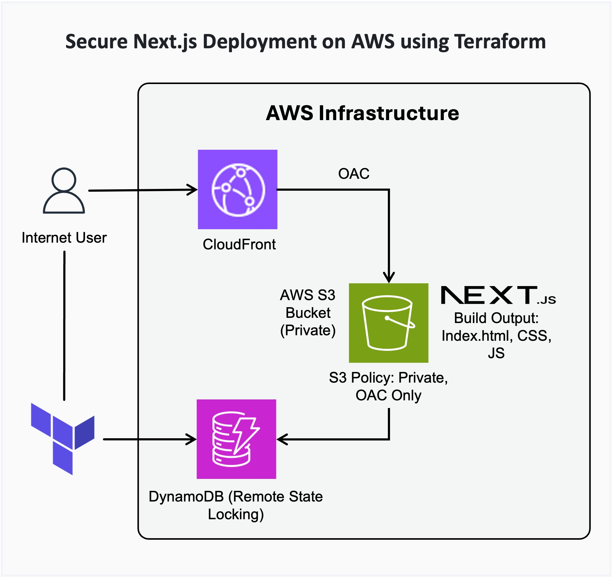

# Secure Next.js Deployment on AWS using Terraform

This repository contains the application code and the **Infrastructure as Code (IaC)** necessary to deploy a high-performance, secure, and cost-effective **Next.js static portfolio website** onto **Amazon Web Services (AWS)**.

The entire infrastructure stack is provisioned and managed using **Terraform**, ensuring consistency, auditability, and rapid, automated deployment.


## Next.js Walkthrough
For a guided tour of this project's Next.js application structure, including key file locations and folders (pages, components, public), please view the video below.

[Watch it here](https://www.loom.com/share/3108d233ab8a4d0b81139069f0292fee?sid=3c644b05-b8f0-4f38-ae19-b6f63ab39d85)

## Architecture & Technology Stack
The solution utilizes a modern, serverless-adjacent static hosting architecture built for security and scale:




| Component	| Role | Specific Implementation Detail |
|---|---|---|
| CDN & Security	| Global Delivery	| AWS CloudFront with Origin Access Control (OAC) | 
| Content Host	| Storage	| AWS S3 (Private Bucket) with  Next.js (Static Site Generation/SSG) contents | 
| State Management	| Reliability	| Terraform Remote State via S3 and DynamoDB (for state locking) | 
| IaC	| Provisioning	| Terraform | 

### Key Architectural Decisions
The infrastructure is explicitly designed for enterprise-grade security and reliability, as defined in the **`.tf`** files:

  - **Strict Security Posture**: The S3 bucket is not publicly accessible. It uses an S3 Bucket Policy to grant read-only access (**`s3:GetObject`**) exclusively to the specific CloudFront Distribution via Origin Access Control (OAC).
  - **Global Performance**: CloudFront is used as a Content Delivery Network (CDN) to cache assets at edge locations worldwide, minimizing latency.
  - **Encrypted Traffic**: All end-user traffic is automatically redirected to HTTPS via the CloudFront distribution's **`redirect-to-https`** policy.
  - **Secure State Management**: Terraform state is securely stored and encrypted in an S3 backend and uses a DynamoDB table for state locking to prevent concurrent modifications.
  - **Region**: Resources are deployed in the **`eu-west-2`** region.


## Deployment and Usage

### Prerequisites
1. AWS Account and configured AWS CLI credentials.
2. Terraform installed locally.
3. Node.js and npm installed for building the Next.js application.


### 1. Build the Next.js Application
Generate the static HTML and assets into the local out directory:

```Bash

# Clone the application code
git clone https://github.com/<your-username>/terraform-portfolio-project.git
cd terraform-portfolio-project

# Install dependencies and build
npm install
npm run build

# Static files are now available in the 'out' directory

```


### 2. Provision Infrastructure with Terraform
The Terraform configuration automatically sets up the secure S3 bucket, OAC, and CloudFront distribution.

```Bash

cd terraform-nextjs

# Initialize the backend (S3/DynamoDB) and required providers (AWS)
terraform init

# Review the execution plan
terraform plan

# Apply the configuration
terraform apply

```

The remote state is securely managed in the `pk-nextjs-website-state` S3 bucket in the `eu-west-2` region.


### 3. Upload Static Content
After the infrastructure is provisioned, sync the built content to the S3 bucket. You can retrieve the exact bucket ID from the Terraform output:

```Bash

# Get the bucket name from the output
S3_BUCKET=$(terraform output -raw bucket_id)

# Sync the local 'out' directory to the provisioned S3 bucket
aws s3 sync ../blog/out s3://"$S3_BUCKET"

```


### 4. Access the Live Website
The live website URL is the domain name of the CloudFront distribution.

```Bash

# Retrieve the public-facing URL
terraform output cloudfront_url

```

The resulting URL is the access point for the fully deployed and secured Next.js portfolio website.
